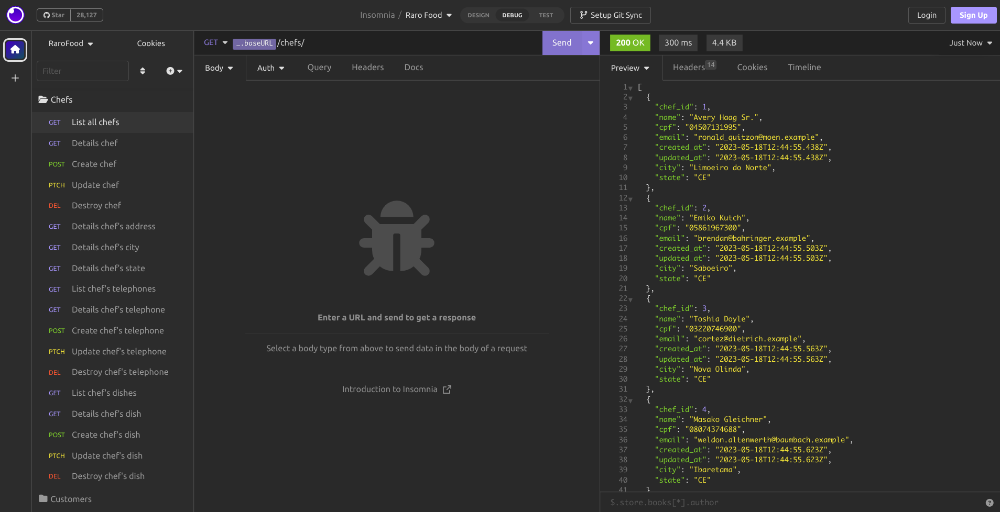
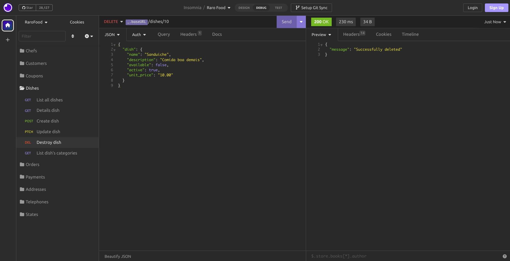

# Controllers - Raro Food

O projeto inicia algumas implementações de rotas e controllers tendo como base o banco de dados modelado durante as semanas 7, 8 e 9 da turma de Ruby on Rails - Raro Academy, referente ao projeto Raro Food.

## Objetivos

Tendo como base o [enunciado do exercício](./.gitlab/enunciado.md), os objetivos são:

- [x] Declarar de forma coerente as rotas, utilizando o formato mais indicado de acordo com os métodos que devem ser expostos;
  - A lista das rotas solicitadas pode ser verificada [aqui](./.gitlab/routes_checklist.md).
- [x] Declarar os controllers e seus respectivos métodos conforme as ações que devem ser expostas.

## Desenvolvimento

A atividade foi iniciada seguindo a lista de rotas do enunciado, foi possível realizar algumas _actions_ básicas e deixa-las funcionando. Contudo, alguns erros foram aparecendo ao tentar acessar os relacionamentos de alguns _models_. Por isso, foi realizada uma refatoração geral utilizando _nested resources_. Usando esse recurso foi possível acessar as informações das rotas corretamente.

Abaixo estão listados outros pontos importantes referente ao desenvolvimento da atividade.

- No projeto utilizado de base já havia um `seeds.rb` com informações de States e Cities, esse arquivo foi incrementado para popular todas as outras tabelas do banco de dados utilizando a gem [Faker](https://github.com/faker-ruby/faker) na sua versão mais recente. Dessa forma, conseguimos visualizar informações ao realizar requisições;
  <br>
- Chef e Customer herdam atributos de _User_, por isso ao renderizar apenas `@customer` o retorno recebido seria a referencia para seu _user_id_. Como foi considerado importante retornar todas as informações como _name_, _cpf_ e _e-mail_, na action **show** desses dois controllers foi configurado o formato json necessário para exibir os dados completos;
  <br>
- Foram criados controllers para **Addresses** e **Telephones** e foi acrescentada uma lógica para que seja possível identificar as informações que pertencem a _Chef_ ou _Customer_ sendo possível que suas actions retorne corretamente as informações. Com esses controllers criados, foi optado por expor algumas rotas extras, tais quais:

  - /telephones
  - /telephones/:id
  - /addresses
  - /addresses/:id
    <br>

- No controller de **Dishes** também foi incluído um `if` para que a action index verifique se a requisição está vindo da rota de _Order_ ou de _Chef_;
  <br>
- Outro controller criado foi o **order_items_controller** que gerencia as actions das rotas que _Order_ precisa para visualização dos seus itens;
  <br>
- Com todas as rotas de busca (verbo GET) funcionando corretamente, foi iniciada a tentativa de implementação de outros verbos. Antes de iniciar esse estágio, foi feita uma analise da modelagem com o objetivo de entender o que poderia receber uma rota para _delete_ e _update_. O próximo passo então foi realizar uma action de update em Payment, primeiro liberando essa rota no "resources", depois ajustando o Controller com a função `payment_params`(incluída como _before_action_) que declara quais campos são interessantes de serem atualizados. Por fim, a action update retorna uma renderização do resultado ou uma mensagem de erro, caso a ação não seja executada.
  <br>
- Por conta de algumas relações da modelagem, foi necessário ainda definir uma função `belongs_to...?` nos controllers de Card, Dish, Order e Telephones para validar se, por exemplo, o dish alterado pertencia ao chef do parâmetro utilizado, caso não seja, a action não acontece e renderiza uma mensagem de erro. Após conseguir implementar as rotas e actions de update, foi realizado o mesmo processo para _delete_, tanto para Payment como para os controllers: Dishes, Cards, Coupons, Orders, OrderItems e Telephones. Sempre testando com o auxílio do Insomnia o funcionamento das implementações.
  <br>
- A implementação de _update_ em Chefs e Customers seguiu o mesmo fluxo das citadas anteriormente, porém foi necessário realizar uma pequena validação para que na action fossem considerados também os atributos que ambos herdam de User.
  <br>
- Após todos esses passos, já havia um entendimento melhor das rotas, seus funcionamentos, dos callbacks que poderiam ser utilizados nos controllers e como trabalhar com os parâmetros, então foi iniciado o último passo, que foi a implementação da action _create_. Primeiro com as entidades que não possuem relação com User, seguindo os passos anteriores: liberando a rota no escopo do resources (sempre verificando com `rails routes -g... `); definindo a _action_ no Controller correspondente e testando com o Insomnia. Nesse passo foi necessário realizar algumas pesquisas, gerar um projeto teste com _scafolld_ para entender o que poderia acontecer na action e os parâmetros enviados. Por fim, mais uma vez, para o filhos de User foi necessário utilizar uma lógica diferente por conta dos atributos herdados.

### Extras

- **ControllersHelper**
  - Foi criado um helper para os controllers em geral, no intuito de disponibilizar uma função auxiliar chamada `errors_full`, que fica responsável por receber as entidades que participam de um respectivo request, mapeando-as e retornam os seus erros, caso haja.
- **Custom json**
  - Em alguns modelos, como _Chef_ e _Customer_, foi escolhido exibir um _json_ personalizado, já que suas informações principais são herdados de User. Então esses controllers possuem um método que recebe como parâmetro a instância e gera esse modelo, evitando assim, repetições desnecessários, pois o objetivo é sempre respeitar o conceito de DRY (Don't repeat yourself) visto nas semanas anteriores.

### Resultado

Os testes das rotas implementadas foram realizados utilizando o [Insomnia](https://insomnia.rest), através de um ambiente que foi criado e dentro dele _folders_ com todas as requisições necessárias. Abaixo podem ser visualizados alguns resultados, mas para verificar todos é possível realizar o _import_ do arquivo [_insomnia.json_](./insomnia.json) que está na raiz do projeto. Lembrando que algumas requisições vão requerer um request válido, já que o seed é feito de forma aleatória e pode não ser possível encontrar um _id_ específico que seja válido.

  <div align="center">
    
    
    
  </div>

  <div align="center">
    
    
    
  </div>

## Setup

O projeto foi realizado utilizando as versões:

- ruby 3.1.2;
- rails 7.0.4.3.

Antes de iniciar a aplicação, é necessário exportar as variáveis de ambientes no terminal, de acordo com seu acesso pessoal ao MySQL:

```bash
  export MYQSL_USER=SEU_USUARIO
  export MYQSL_PASSWORD=SUA_SENHA
  export MYQSL_HOST=localhost
```

Recomenda-se também a execução da seguinte sequência de comandos:

```bash
  bundle install
  rails db:create
  rails db:migrate
  rails db:seed
```

Para iniciar o servidor recomenda-se a utilização do comando `rails server`.

É possível, caso queira, aproveitar as requisições previamente configuradas usando o [Insomnia](https://insomnia.rest), basta importar esse [arquivo](./insomnia.json).
